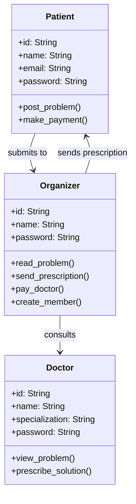
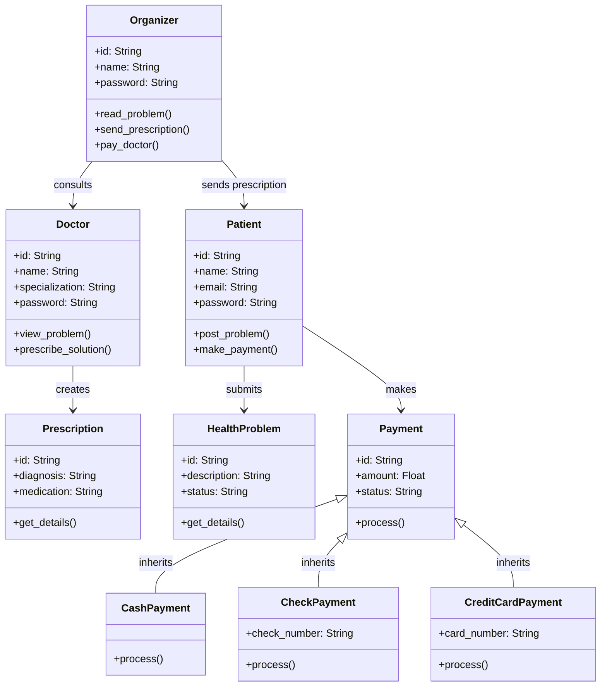
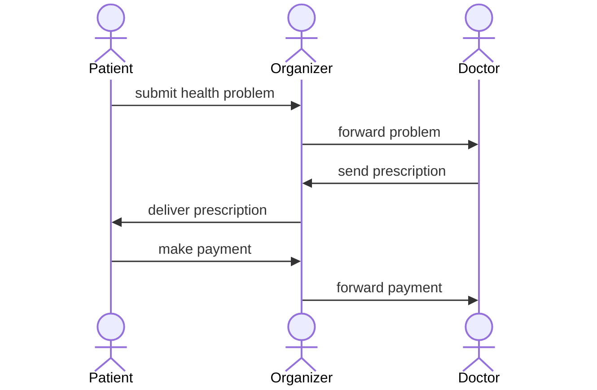
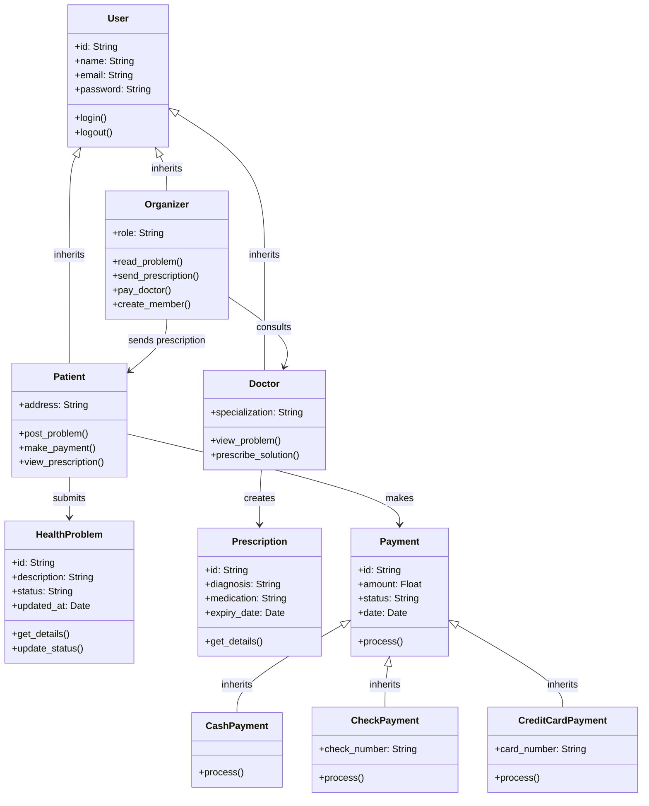
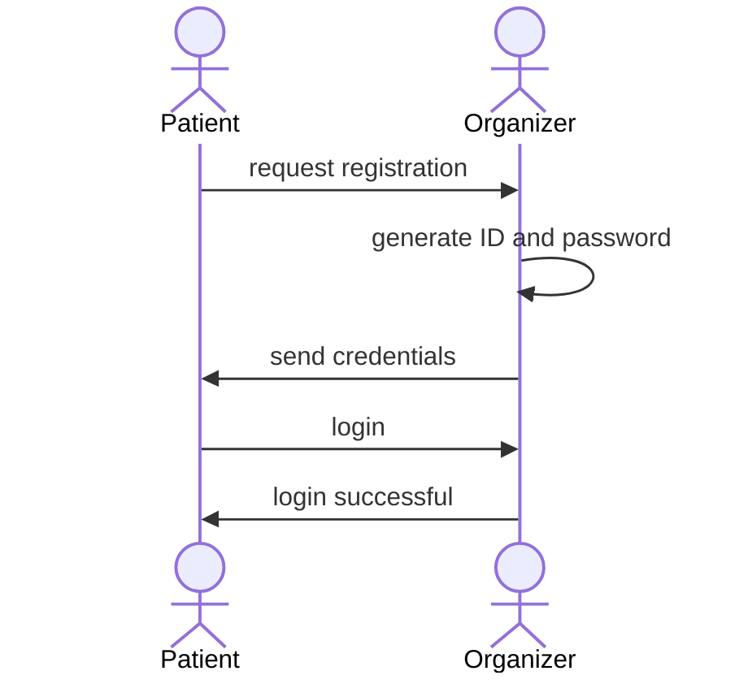
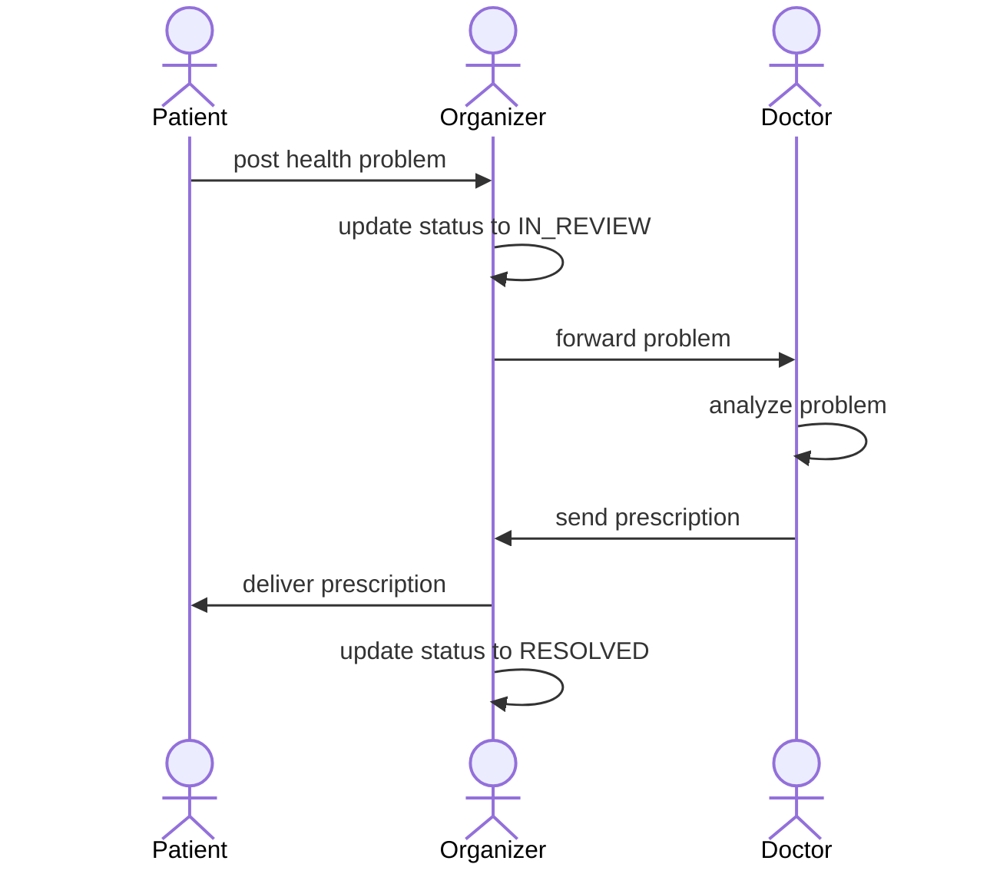
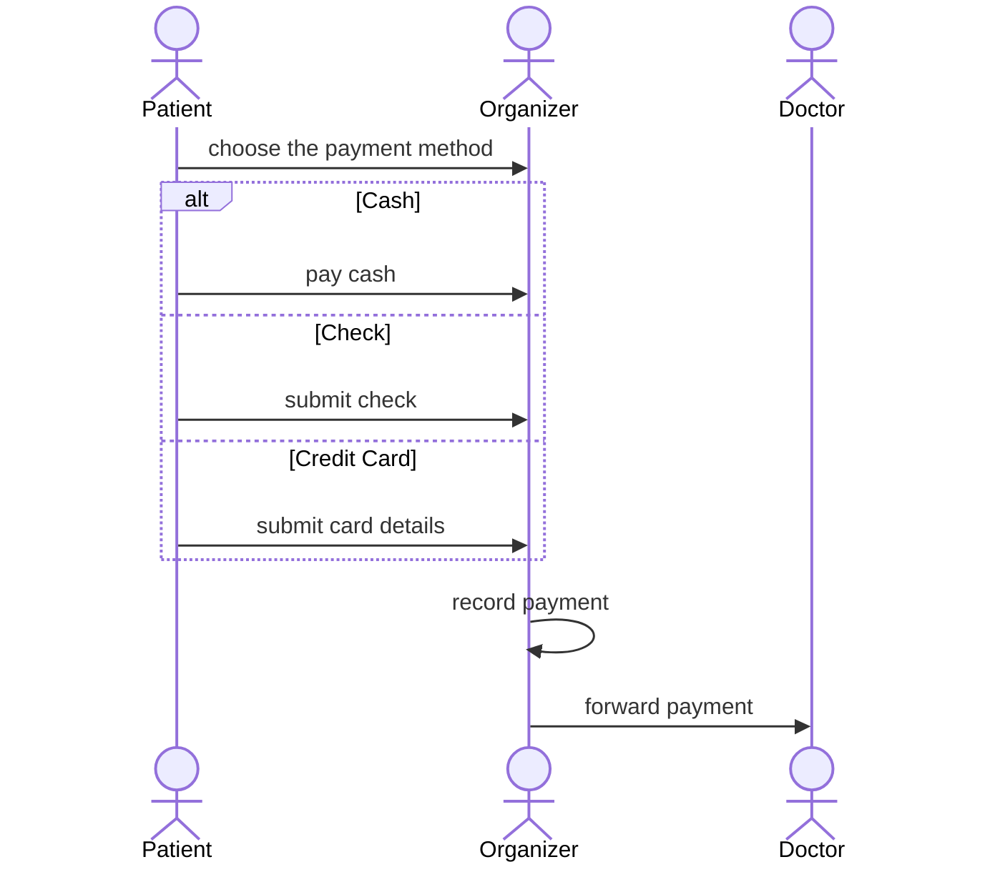

# Exercice 1 - Hospital Management System

## Task 1 - Basic Class Diagram

## Task 2 - Complete Class Diagram

## Task 2 - Sequence Diagram

## Task 3 - Advanced Class Diagram

## Sequence Diagram 1: Patient Registration

## Sequence Diagram 2: Consultation Flow

## Sequence Diagram 3: Payment Processing

## Questions to consider

**1. How would you handle a patient consulting multiple doctors?**
A Patient can be linked to multiple Doctors through the Organizer. Moreover, we could add a list of doctors to the HealthProblem class, making it a one to many relationship between Patient and Doctor.

**2. Should prescriptions be reusable? How would you model that?**
Yes, for chronic conditions. We could add a `is_reusable: Boolean` and `expiry_date: Date` attribute to the Prescription class, and link it to multiple HealthProblems.

**3. What design pattern fits the payment system?**
The Strategy pattern fits well as Payment is the base class and CashPayment, CheckPayment, CreditCardPayment each implement their own `process()` method differently.

**4. How do you ensure data integrity when payments are processed?**
We can add a `status` attribute to Payment (pending, completed, failed) and only mark it complete once the Organizer confirms receipt. The Doctor only gets paid after the status is completed.
